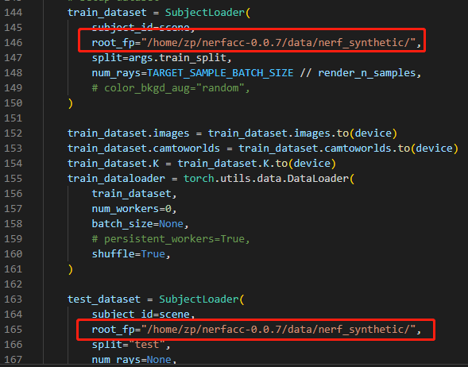

# 创建虚拟环境（nerfacc_0.0.7）指定Python版本
conda create -n nerfacc_0.0.7 python=3.9
# 首次使用 source activate 命令激活虚拟环境 nerfacc_0.0.7
source activate nerfacc_0.0.7或conda activate nerfacc_0.0.7
# 退出虚拟环境
conda deactivate
# 查看python版本
python --version
# 打开README.md查看运行命令(运行nerf_ngp:)
python examples/trainval.py ngp --train_split trainval

# 提示包未安装 安装包
numpy
tqdm
imageio

# 查看cuda版本（我的11.8）
nvcc -v
# 根据cuda版本去pytorch官网查看torch安装命令
pip3 install torch torchvision torchaudio --index-url https://download.pytorch.org/whl/cu118

#报错提示安装'tinycudann'(Error: No module named 'tinycudann'! Please install tinycudann by: pip install git+https://github.com/NVlabs/tiny-cuda-nn/#subdirectory=bindings/torch)
pip install git+https://github.com/NVlabs/tiny-cuda-nn/#subdirectory=bindings/torch
也可以去github官网手动下载'tinycudann'(参考https://blog.csdn.net/yangyu0515/article/details/131959907)

# 运行时报错1：

'ImportError: cannot import name 'OccupancyField' from 'nerfacc' (/home/zp/.conda/envs/nerfacc_0.0.7/lib/python3.9/site-packages/nerfacc/__init__.py)'
原因：
安装了nerfacc包，与项目中的nerfacc目录冲突
解决办法：
卸载nerfacc: 
pip uninstall nerfacc
在所运行的.py文件中添加代码运行的搜索路径：
import sys
sys.path.append('/home/zp/nerfacc-0.0.7/examples')
sys.path.append('/home/zp/nerfacc-0.0.7')

# 运行时报错2：

'FileNotFoundError: [Errno 2] No such file or directory: '/home/ruilongli/data/nerf_synthetic/lego/transforms_train.json''
解决办法：
没有添加数据集，缺少.json文件，在项目中添加数据集, 并在代码中更改数据集路径

