# 创建虚拟环境（nerfacc_0.5.3）指定Python版本
conda create -n nerfacc_0.5.3 python=3.8
# 激活虚拟环境
source activate nerfacc_0.5.3
# 退出虚拟环境
conda deactivate

# 提示包未安装 安装包
imageio
tqdm
lpips
rich

# 查看cuda版本（11.8）
nvcc -V

# 打开README.md查看运行命令(运行nerf_ngp:)
python examples/trainval.py ngp --train_split trainval

# 根据cuda版本去pytorch官网查看torch安装命令
pip3 install torch torchvision torchaudio --index-url https://download.pytorch.org/whl/cu118

# 报错1
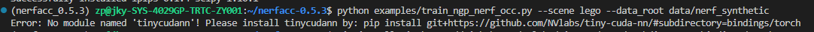
提示安装'tinycudann'(Error: No module named 'tinycudann'! Please install tinycudann by: pip install git+https://github.com/NVlabs/tiny-cuda-nn/#subdirectory=bindings/torch)
pip install git+https://github.com/NVlabs/tiny-cuda-nn/#subdirectory=bindings/torch
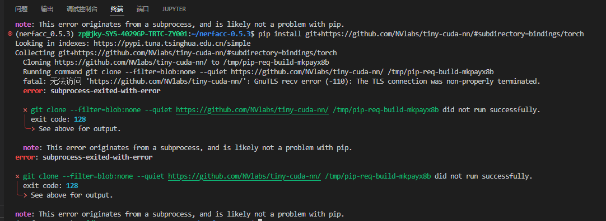
如果pip install 下载不成功 需要去github官网手动下载'tinycudann'(参考https://blog.csdn.net/yangyu0515/article/details/131959907)
直接下载(不推荐) 会导致部分文件缺失(dependencies\fmt和dependencies\cutlass文件夹内是空的)，需要再单独下载再放到文件对应文件夹内。
【tiny-cuda-nn的下载地址】【fmt的下载地址】【cutlass的下载地址】解压fmt和cutlass，并将文件内容放到dependencies\fmt和dependencies\cutlass中
手动下载好后 cd到 tiny-cuda-nn/bindings/torch目录下，运行如下命令：
python setup.py install
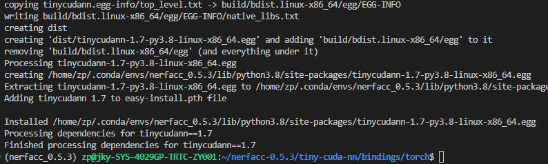

# 报错2
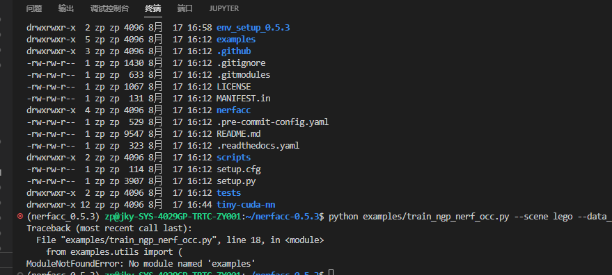
在所运行的.py文件开头添加代码运行的搜索路径：
import sys
sys.path.append('/home/zp/nerfacc-0.5.3')
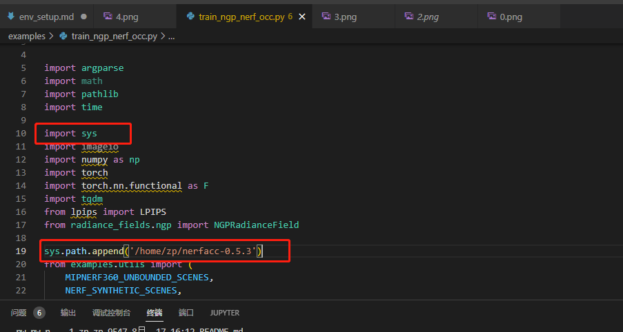

# 报错3
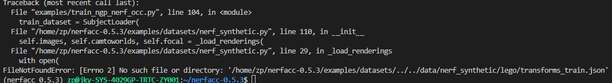
解决办法：
没有添加数据集，缺少.json文件，在项目中添加数据集, 并在代码中更改数据集路径
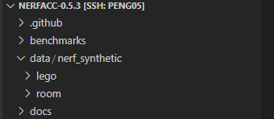

# 更换数据集进行测试（lego-->room）
将数据集下载好放在项目目录中，确保代码中数据集路径正确：

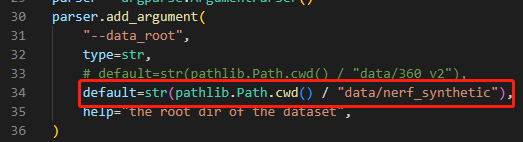

切换数据集为room时，
如果为debug模式，需要在代码中更改parser.add_argument中的默认参数 把 'default=lego' 改成 'default=room',

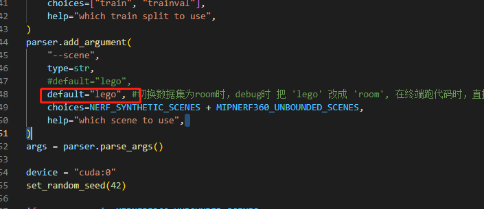

在终端跑代码时，直接修改命令参数，即将
'python examples/train_ngp_nerf_occ.py --scene lego --data_root data/nerf_synthetic'，改为'python examples/train_ngp_nerf_occ.py --scene room --data_root data/nerf_synthetic'

# 报错
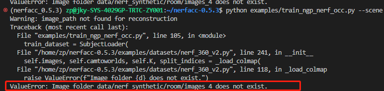
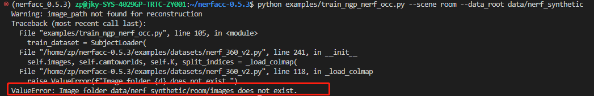

room数据集中缺少images和images_*文件，补充进去就好

完整的数据集，目录如下图所示：

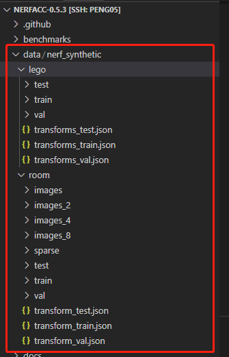

数据集补充完整后，确保代码中数据集路径正确，就可以开始训练了
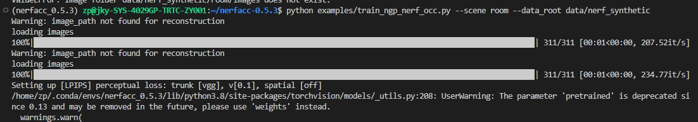

